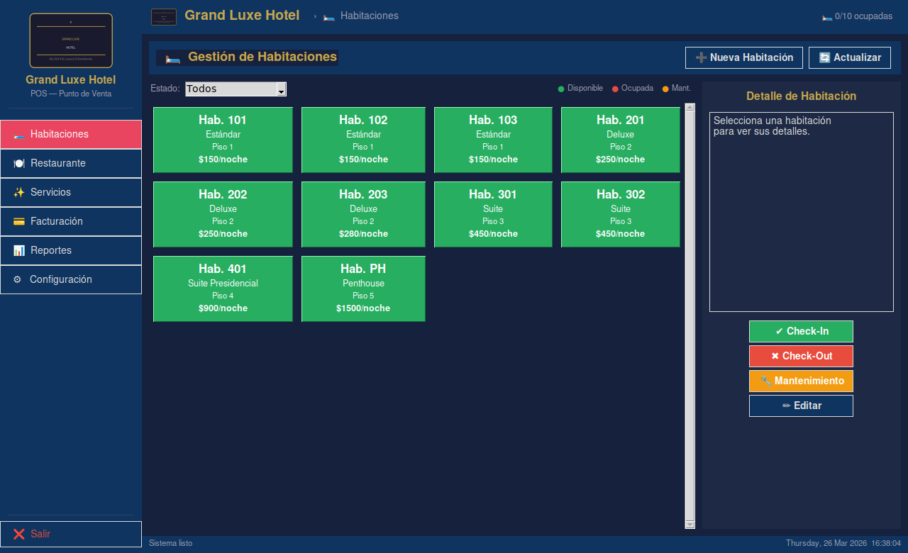
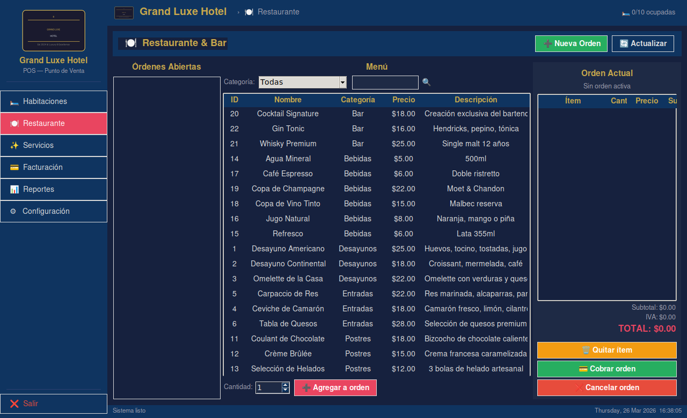
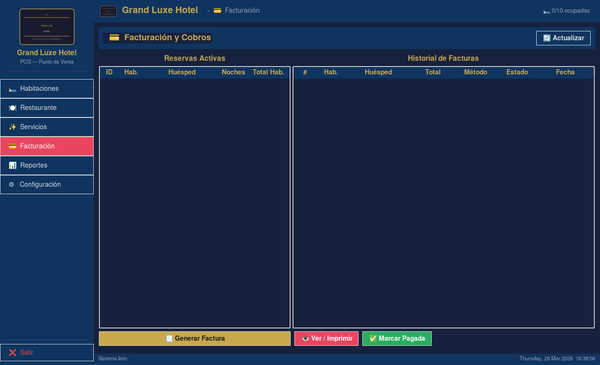
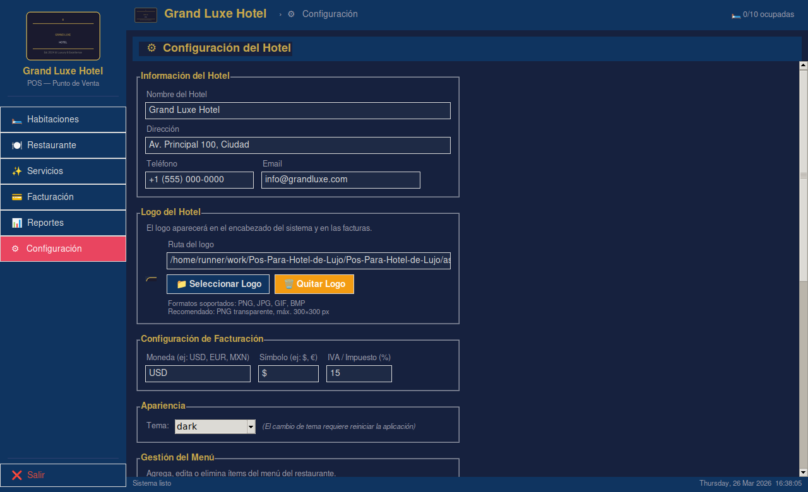

# 🏨 POS Para Hotel de Lujo

Sistema de Punto de Venta (POS) completo para hoteles de lujo, desarrollado en Python con interfaz gráfica tkinter.

---

## ✨ Características principales

| Módulo | Funciones |
|--------|-----------|
| 🛏 **Habitaciones** | Mapa visual de habitaciones por piso, check-in, check-out, mantenimiento, alta de nuevas habitaciones |
| 🍽 **Restaurante & Bar** | Órdenes abiertas, menú por categorías, agregar/quitar ítems, cobrar, cálculo automático de IVA |
| ✨ **Servicios** | Catálogo de spa, lavandería, transporte, room service; registro de servicios a habitación |
| 💳 **Facturación** | Generación de facturas con logo del hotel, historial, múltiples métodos de pago |
| 📊 **Reportes** | Resumen del día, reporte por período, ocupación de habitaciones, directorio de huéspedes |
| ⚙ **Configuración** | Nombre del hotel, logotipo, dirección, IVA, moneda, tema visual, gestión del menú |

### 🖼 Logo del hotel
- Sube cualquier imagen (PNG, JPG, BMP, GIF) como logotipo del hotel
- El logo aparece en la **barra lateral**, la **cabecera** y en cada **factura imprimible**
- Configurable desde `⚙ Configuración → Logo del Hotel`

---

## 📷 Capturas de pantalla

**Panel de Habitaciones**


**Restaurante & Bar**


**Facturación**


**Configuración & Logo**


---

## 🚀 Instalación y uso

### Requisitos
- Python 3.8 o superior
- `tkinter` (incluido en Python estándar; en Ubuntu: `sudo apt install python3-tk`)
- `Pillow` (para mostrar el logo del hotel)

### Instalación rápida

```bash
# 1. Clonar el repositorio
git clone https://github.com/Norbackvc/Pos-Para-Hotel-de-Lujo.git
cd Pos-Para-Hotel-de-Lujo

# 2. Instalar dependencias
pip install -r requirements.txt

# En Ubuntu/Debian también instalar tkinter si no está:
# sudo apt install python3-tk

# 3. Ejecutar
python hotel_pos.py
```

---

## 🗂 Estructura del proyecto

```
hotel_pos.py              ← Punto de entrada principal
requirements.txt          ← Dependencias (solo Pillow)
hotel_pos.db              ← Base de datos SQLite (se crea automáticamente)

modules/
  database.py             ← Capa de datos (SQLite)
  theme.py                ← Paleta de colores (dark/light)
  widgets.py              ← Componentes UI reutilizables
  ui_rooms.py             ← Panel de habitaciones
  ui_restaurant.py        ← Panel de restaurante/bar
  ui_services.py          ← Panel de servicios
  ui_billing.py           ← Panel de facturación
  ui_reports.py           ← Panel de reportes
  ui_settings.py          ← Panel de configuración

assets/
  logo_hotel.png          ← Logo de ejemplo (reemplaza con tu logo)
```

---

## ⚙ Configuración inicial

1. Abre la app → ve a **⚙ Configuración**
2. Completa el nombre, dirección y datos del hotel
3. En **Logo del Hotel**, haz clic en **📁 Seleccionar Logo** y elige tu imagen
4. Ajusta el IVA y moneda
5. Haz clic en **💾 Guardar Configuración**

---

## 🛏 Flujo de trabajo típico

```
1. Check-in     →  Habitaciones → Seleccionar hab. disponible → ✔ Check-In
2. Consumos     →  Restaurante  → Nueva Orden → Agregar ítems → Cobrar
3. Servicios    →  Servicios    → Seleccionar servicio → Registrar a huésped
4. Check-out    →  Facturación  → Seleccionar reserva  → Generar Factura
5. Reporte      →  Reportes     → Ver ingresos del día
```

---

## 📦 Tecnologías

- **Python 3** — Lenguaje principal
- **tkinter** — Interfaz gráfica (incluido en Python estándar)
- **SQLite3** — Base de datos local (sin servidor)
- **Pillow** — Procesamiento de imágenes (logo del hotel)

---

*Desarrollado para la gestión integral de un hotel de lujo.*
